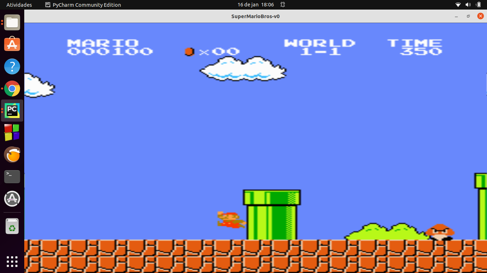
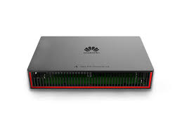

# Mario-AI-Playing
An application who emulates super mario game and puts an AI to play

# Steps
-> First, you need to have a python interpreter on your machine  
-> Them, just run "python run.py" on your terminal or play run.py on pycharm IDE  
-> It should work and show a screen running Mario  

-> If you want to train a better model, them uncomment the function "training model" in class App

# Next Steps

- The ML model isn't good yet, for this purpose we need a better computer to run the application and train the algorithm
  (Or many hours waiting a better processing) 
- For solve this problem, I pretend to use the Huawei's solution Atlas 200 DK   

- It is a developer kit for AI purposes who have Ascend 310 processor

